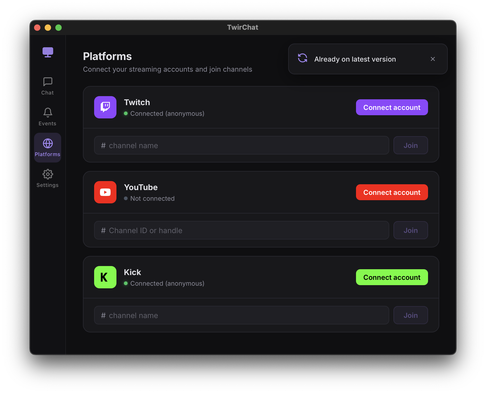

# TwirChat

Multi-platform chat manager for streamers (Twitch, YouTube, Kick).




## Installation

Desktop releases are published from stable `vX.Y.Z` tags only. Velopack publishes one feed per
platform: `releases.linux.json`, `releases.win.json`, and `releases.osx.json`. Current installers are
unsigned and the macOS build is not notarized.

### Linux

To install the latest stable Linux AppImage:

```bash
curl -fsSL https://raw.githubusercontent.com/Satont/twirchat/main/scripts/install-linux.sh | bash
```

The script detects the `.AppImage` asset from the latest GitHub Release, installs it under
`~/.local/share/dev.twirchat.app`, creates a `twirchat` symlink, and adds a desktop entry. You can
also download the standalone `.AppImage` directly from the
[Releases](https://github.com/Satont/twirchat/releases/latest) page.

### Windows

1. Download the latest Windows Velopack Setup `.exe` from
   [Releases](https://github.com/Satont/twirchat/releases/latest).
2. Run the installer to install TwirChat.

### macOS

1. Download the latest macOS Velopack `.pkg` from
   [Releases](https://github.com/Satont/twirchat/releases/latest).
2. Run the package installer. The packaged app bundle is `TwirChat.app`.

## Updates

Packaged desktop builds initialize Velopack at startup, check the platform feed on startup and
periodically while automatic checks are enabled, show an in-app update toast when a stable update is
available, and can download the update before restarting to apply it.
